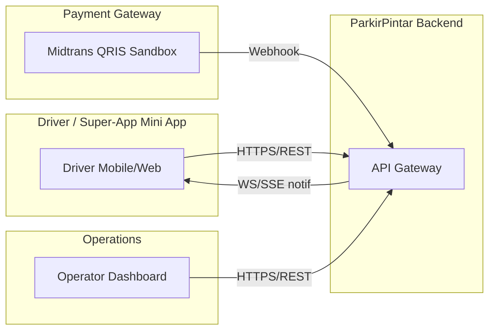
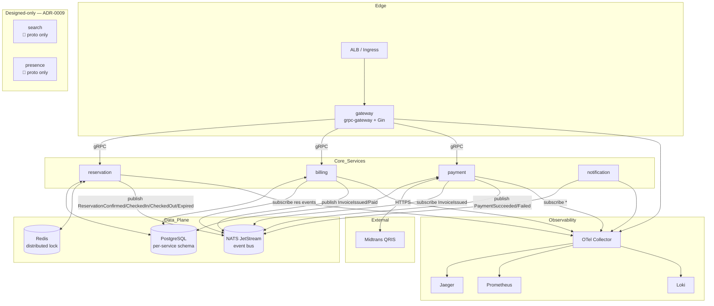
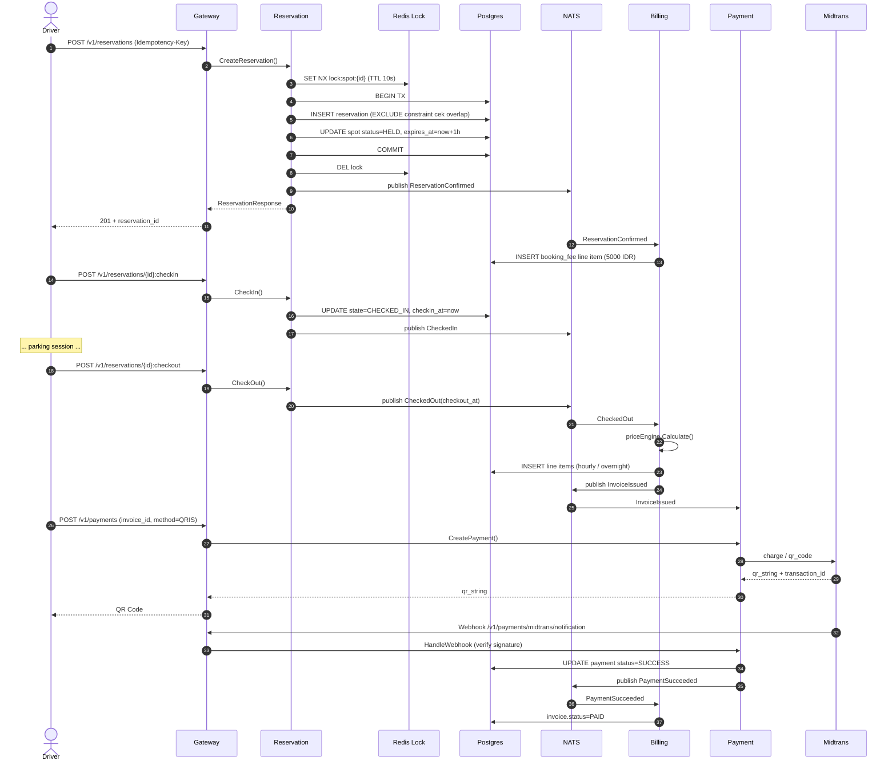
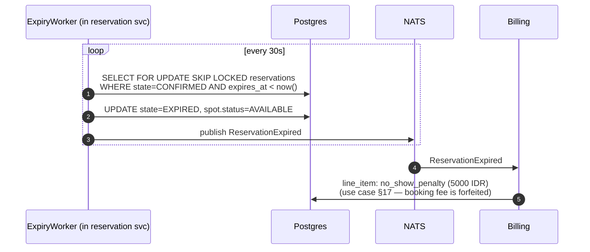
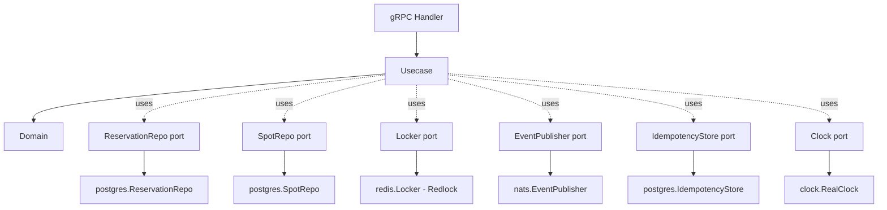
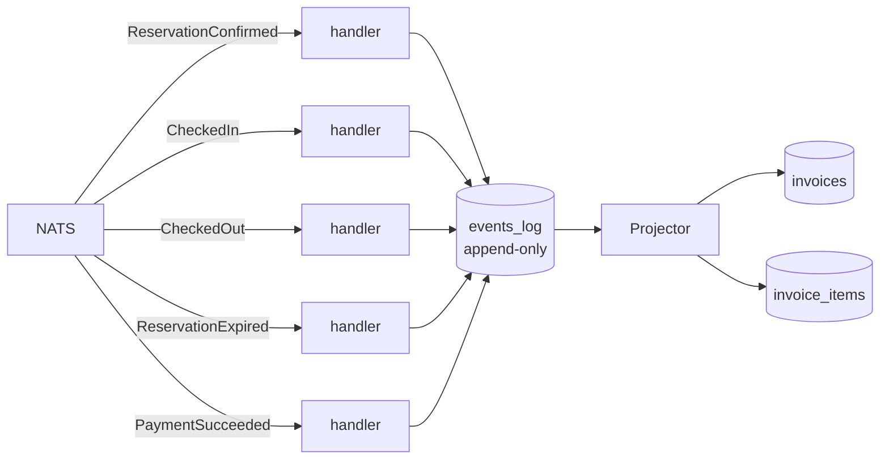
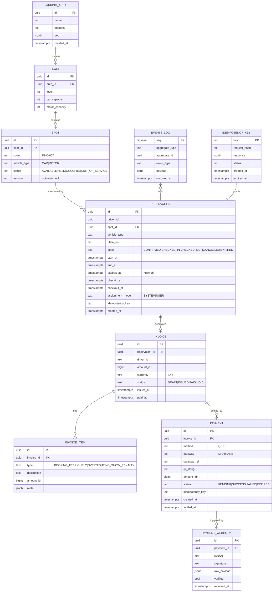

# ParkirPintar — Smart Parking Backend

> Production-grade microservices backend untuk sistem reservasi parkir cerdas, dibangun dengan **Go**, **gRPC/HTTP-2**, **PostgreSQL**, **Redis**, **NATS JetStream**, dan **OpenTelemetry**. Deploy fleksibel ke Docker Compose, Kubernetes/OpenShift, atau AWS (ECS Fargate).

| | |
|---|---|
| **Author** | Aji Perdana Putra (`ajiperdanaputra90@gmail.com`) |
| **Domain** | Smart Parking Marketplace (single area, 5 floors, 150 mobil + 250 motor) |
| **Status** | Assessment H1 2026 — Senior Backend Developer |
| **Stack** | Go 1.22, gRPC, grpc-gateway, PostgreSQL 16, Redis 7, NATS JetStream, OpenTelemetry, Prometheus, Jaeger |
| **License** | Internal — assessment only |

---

## Daftar Isi

1. [Ringkasan Solusi](#1-ringkasan-solusi)
2. [High Level Design (HLD)](#2-high-level-design-hld)
3. [Low Level Design (LLD)](#3-low-level-design-lld)
4. [Entity Relationship Diagram (ERD)](#4-entity-relationship-diagram-erd)
5. [Reusable Components](#5-reusable-components)
6. [Resilience, Consistency & Idempotency](#6-resilience-consistency--idempotency)
7. [Pricing Engine](#7-pricing-engine)
8. [Testing Strategy](#8-testing-strategy)
9. [Quick Start (Demo)](#9-quick-start-demo)
10. [Deployment Options](#10-deployment-options)
11. [Observability](#11-observability)
12. [Security](#12-security)
13. [Architecture Decision Records](#13-architecture-decision-records)
14. [Roadmap & Trade-offs](#14-roadmap--trade-offs)

---

## 1. Ringkasan Solusi

ParkirPintar adalah backend microservices untuk **satu** parking area terpusat (5 lantai, 150 mobil + 250 motor) dengan fokus *lite, simple, fast*. Driver melihat ketersediaan, memesan slot (system-assigned atau user-selected), check-in/check-out, dan dibilling otomatis berdasarkan durasi parkir aktual.

**Service decomposition** mengikuti rekomendasi pada use case dengan justifikasi pada [ADR-0001](docs/architecture/adr/0001-microservices-vs-monolith.md):

| Service | Role | Comm | Fokus implementasi |
|---|---|---|---|
| `gateway` | REST→gRPC translator (grpc-gateway), auth, rate limit, request-id | HTTP/JSON ↔ gRPC | ✅ Full |
| `reservation` | Inventory, locking, hold-1-jam, lifecycle reservasi | gRPC | ✅ Full (core) |
| `billing` | Event-sourced invoice, pricing engine, no-show penalty | gRPC + NATS sub | ✅ Full (core) |
| `payment` | Midtrans QRIS sandbox, webhook, idempotent capture | gRPC + HTTP webhook + NATS pub | ✅ Full |
| `notification` | Email/push consumer dari NATS event | NATS sub | ✅ Skeleton (mock) |
| `search` | Future read-model availability multi-area | gRPC | 📐 **Designed only** ([ADR-0009](docs/architecture/adr/0009-defer-search-presence-services.md)) |
| `presence` | Future location streaming + geofencing | gRPC bidi-stream | 📐 **Designed only** ([ADR-0009](docs/architecture/adr/0009-defer-search-presence-services.md)) |

> **Implementasi**: 5 service aktif (gateway, reservation, billing, payment, notification) yang fully memenuhi semua use case scenario.
>
> **Design only**: `search` & `presence` di-defer sesuai justifikasi formal di [ADR-0009](docs/architecture/adr/0009-defer-search-presence-services.md). Kontrak `.proto` tetap dipertahankan di [`proto/search/v1/`](proto/search/v1/) dan [`proto/presence/v1/`](proto/presence/v1/) sebagai forward-ready API — siap implement saat scope expand (mis. multi-area, geofencing).

---

## 2. High Level Design (HLD)

### 2.1 Context (C4 Level 1)



### 2.2 Container Diagram (C4 Level 2)



### 2.3 Reservation → Billing → Payment Sequence



### 2.4 No-show / Auto-Expiry Flow



---

## 3. Low Level Design (LLD)

### 3.1 Layered Architecture per Service (Hexagonal / Ports & Adapters)

Setiap service mengikuti struktur:

```
services/<svc>/
├── cmd/                          # main.go
├── internal/
│   ├── domain/                   # entitas + business rules (pure Go, no deps)
│   │   ├── reservation.go
│   │   ├── spot.go
│   │   └── errors.go
│   ├── usecase/                  # application services (orchestration)
│   │   ├── create_reservation.go
│   │   ├── checkin.go
│   │   ├── checkout.go
│   │   └── ports.go              # interfaces yang dibutuhkan
│   ├── adapter/
│   │   ├── grpcserver/           # primary adapter (gRPC handler)
│   │   ├── postgres/             # secondary adapter (sqlc-generated)
│   │   ├── redis/                # secondary adapter (lock)
│   │   └── nats/                 # secondary adapter (event publisher)
│   └── config/                   # service-specific config struct
└── Dockerfile
```

**Why Hexagonal?** Dependency inversion — domain tidak tahu tentang Postgres atau gRPC. Memudahkan testing (mock ports), swap database, dan migrasi gRPC↔HTTP.

### 3.2 Reservation Service — Internals



### 3.3 Concurrency Control — Double-Booking Prevention

Tiga lapis pertahanan (defense in depth — lihat [ADR-0004](docs/architecture/adr/0004-locking-strategy.md)):

1. **Application lock (Redis Redlock)** — TTL 10 detik, key `lock:spot:{spot_id}`. Cepat fail kalau ada kontensi user-selected.
2. **DB row lock (`SELECT ... FOR UPDATE`)** — pastikan transaksi mengunci row spot sebelum insert reservation.
3. **PostgreSQL `EXCLUDE` constraint dengan `gist`** — *defense in depth* level data: tidak mungkin ada dua reservation dengan spot_id sama dan time-range overlap, **bahkan jika** aplikasi bug.

```sql
ALTER TABLE reservations
ADD CONSTRAINT no_overlap
EXCLUDE USING gist (
    spot_id WITH =,
    tstzrange(start_at, end_at, '[)') WITH &&
)
WHERE (state IN ('CONFIRMED','CHECKED_IN'));
```

### 3.4 Billing Service — Event-Sourced Projection



`events_log` berfungsi sebagai source of truth — invoice & line items di-derive (projection). Memenuhi kompetensi *event sourcing* (kompetensi #1.5, #2.3).

### 3.5 Idempotency

Setiap request mutasi (`CreateReservation`, `IssueInvoice`, `CreatePayment`) wajib menyertakan header `Idempotency-Key`. Mekanisme:

```
key := "<service>:<op>:<idempotency-key-from-client>"
hash := sha256(serialize(request_body))

INSERT INTO idempotency_keys (key, request_hash, response_body, status)
VALUES (...) ON CONFLICT (key) DO NOTHING

Jika konflik:
  - request_hash sama → return cached response
  - request_hash beda → 409 IdempotencyConflict
```

Lihat [`pkg/idempotency/`](pkg/idempotency/store.go).

### 3.6 Resilience Patterns

| Pattern | Implementasi | Lokasi |
|---|---|---|
| Timeout | gRPC `context.WithTimeout` per call | `pkg/grpcutil/timeout.go` |
| Retry (with jitter) | `grpc-go-retry` middleware | `pkg/grpcutil/retry.go` |
| Circuit Breaker | `sony/gobreaker` per upstream | `pkg/grpcutil/breaker.go` |
| Bulkhead | per-service connection pool limit | per service config |
| Rate limit | `tollbooth` di gateway | `services/gateway` |
| Graceful degradation | `notification` failure tidak block reservation; NATS down → fallback ke noop publisher | usecase wrap dgn `errs.IsCritical()` |

---

## 4. Entity Relationship Diagram (ERD)

> Database per service (logical). Untuk demo kita pakai satu PostgreSQL instance dengan **schema** terpisah (`reservation`, `billing`, `payment`).



DDL lengkap ada di [`migrations/`](migrations/).

---

## 5. Reusable Components

| Package | Fungsi | Dipakai oleh |
|---|---|---|
| `pkg/config` | Viper-based loader (env > yaml > default) dengan validasi | semua |
| `pkg/logger` | Zap structured logger + context-aware fields (request_id, trace_id) | semua |
| `pkg/tracing` | OpenTelemetry tracer init, OTLP exporter | semua |
| `pkg/lock` | Distributed lock interface (impl: Redis Redlock, in-memory untuk test) | reservation |
| `pkg/pricing` | Pure pricing engine — testable, deterministic | billing |
| `pkg/idempotency` | Idempotency-Key store (port + Postgres impl) | reservation, billing, payment |
| `pkg/grpcutil` | Interceptor: recovery, logging, tracing, retry, timeout, circuit breaker | semua server & client |
| `pkg/eventbus` | NATS JetStream wrapper dengan typed publish/subscribe | semua publisher/subscriber |
| `pkg/db` | pgx pool init + migrate runner | semua yg pakai DB |
| `pkg/errs` | Typed domain errors → gRPC status code mapping | semua |
| `pkg/money` | `Money` value object (Rp), no float arithmetic | pricing, billing, payment |
| `pkg/clock` | `Clock` interface untuk testability | semua time-sensitive |

---

## 6. Resilience, Consistency & Idempotency

### 6.1 CAP — Pilihan Eksplisit

| Domain | Pilihan | Alasan |
|---|---|---|
| Reservation (booking) | **CP** (consistency > availability) | Double-book = revenue & UX disaster. Lebih baik gagal request daripada double-book. |
| Search/Availability | **AP** (eventual consistency) | Read-heavy, snapshot 1-2 detik basi tidak masalah. |
| Notification | **AP** | Best-effort. |
| Billing projection | **CP** dalam 1 service, **eventual** lintas service | Invoice harus konsisten internal, tapi update dari NATS event boleh delay sub-second. |

### 6.2 Idempotency End-to-End

`Idempotency-Key` di header REST → propagate sebagai gRPC metadata `x-idempotency-key` → disimpan di tabel `idempotency_keys` per service.

### 6.3 Saga (Choreography) — Reservation lifecycle

Reservation → Billing → Payment → Billing (confirm) → Notification — semua terkoordinasi via NATS event, tidak ada distributed transaction. Compensating action: jika `PaymentFailed`, reservation tetap valid sampai expiry; user bisa retry payment.

---

## 7. Pricing Engine

Implementasi: [`pkg/pricing/engine.go`](pkg/pricing/engine.go).

Aturan (sesuai use case):

| Komponen | Aturan | Implementasi |
|---|---|---|
| Booking fee | `5000 IDR` per reservation **terkonfirmasi** | dipublish saat `ReservationConfirmed` |
| Hourly | `5000 IDR` per **started** hour (jam pertama & seterusnya) | `ceil(duration / 1h)` |
| Overnight | flat `20000 IDR` jika sesi melewati tengah malam (00:00 zona Asia/Jakarta) | replace hourly utk segmen overnight |
| No-show penalty | `5000 IDR` jika tidak check-in dalam 1 jam — *booking fee diserap* | trigger oleh `ReservationExpired` |
| Overstay | tidak ada penalty, tetap dihitung jam-jam-an | extension natural |

**Kombinasi**: jika sesi overnight + ada jam normal di hari berikutnya, billing = `booking_fee + overnight_flat + (jam normal × 5000)`. Lihat unit test untuk skenario gabungan.

---

## 8. Testing Strategy

> Detail: [`docs/architecture/testing-strategy.md`](docs/architecture/testing-strategy.md).

Pyramid:

```
         /\
        /E2E\        test/e2e — docker-compose, REST happy+sad path
       /------\
      /  INT   \     test/integration — testcontainers (postgres, redis, nats)
     /----------\
    /   UNIT     \   per-package _test.go (table-driven, fast, parallel)
   /--------------\
```

**Coverage target**: domain & usecase ≥ 85%, pkg/* ≥ 90%, adapters ≥ 60%.

**Non-functional**:
- Performance/load: `k6` di [`test/load/`](test/load/) — 500 RPS reservation, 1000 RPS availability.
- Security: `gosec`, `govulncheck`, `trivy` di CI.
- Chaos: `toxiproxy` integration test untuk simulasi DB lambat / NATS down.

---

## 9. Quick Start (Demo)

```bash
# 1. Boot stack lengkap (postgres, redis, nats, jaeger, prometheus, semua service)
make demo-up

# 2. Tunggu healthy (~20 detik)
make demo-wait

# 3. Seed parking area (5 floor × 30 mobil + 50 motor)
make seed

# 4. Jalankan e2e test (semua skenario use case)
make test-e2e

# 5. Buka:
#    - Swagger UI:    http://localhost:8080/docs
#    - Jaeger:        http://localhost:16686
#    - Grafana:       http://localhost:3000 (admin/admin)
#    - Prometheus:    http://localhost:9090
#    - NATS Monitor:  http://localhost:8222

# 6. Demo flow lewat curl
./scripts/demo.sh
```

---

## 10. Deployment Options

| Target | File | Kapan dipakai |
|---|---|---|
| **Docker Compose** | [`deploy/docker/docker-compose.yml`](deploy/docker/docker-compose.yml) | Dev local & demo presentasi |
| **Kubernetes/OpenShift (Helm)** | [`deploy/helm/parkir-pintar/`](deploy/helm/parkir-pintar/) | Production di OCP (kantor) atau EKS |
| **AWS ECS Fargate (Terraform)** | [`deploy/terraform/aws-ecs/`](deploy/terraform/aws-ecs/) | Production di AWS, hemat ops |
| **OpenShift native** | [`deploy/ocp/`](deploy/ocp/) | Manifest YAML khusus OCP (Route, SCC) |

**Budget-aware untuk demo AWS**: Terraform sudah dikonfigur dengan `t3.small` Fargate task + RDS `db.t3.micro` + ElastiCache `cache.t3.micro`. Estimasi < $30/bulan untuk demo period. Lihat [`deploy/terraform/aws-ecs/README.md`](deploy/terraform/aws-ecs/README.md).

---

## 11. Observability

| Pilar | Tool | Keterangan |
|---|---|---|
| Metrics | Prometheus | RED metrics + custom (booking_total, lock_contention) |
| Traces | OTel Collector → Jaeger | Distributed trace lintas service & DB |
| Logs | Zap → stdout → Loki | Structured JSON, dengan `trace_id` correlation |
| Dashboards | Grafana | Pre-built di [`deploy/docker/grafana/`](deploy/docker/grafana/) |
| Alerts | Prometheus Alertmanager | Rule sample di `deploy/docker/prometheus/rules/` |

---

## 12. Security

| Area | Implementasi | Doc |
|---|---|---|
| Transport | TLS termination di gateway (cert-manager di K8s, ACM di AWS) | runbook |
| AuthN | JWT (HS256 demo, RS256 production) | gateway middleware |
| AuthZ | Role-based (driver, operator) di per-handler | usecase guard |
| Secret mgmt | env var dev, AWS Secrets Manager prod, Vault opsi | terraform |
| Input validation | `go-playground/validator` + proto-gen-validate | per handler |
| OWASP API Top 10 | Mapping checklist di [`docs/security/owasp-checklist.md`](docs/security/owasp-checklist.md) | doc |
| Threat model | STRIDE per service | [`docs/security/threat-model.md`](docs/security/threat-model.md) |
| Webhook signature | HMAC verify Midtrans signature key | payment service |
| Rate limit | per-IP & per-token di gateway | tollbooth |
| Audit log | event_log table = audit trail | billing |
| Pen-test ready | gosec + govulncheck di CI; trivy image scan | `.github/workflows/security.yml` |

---

## 13. Architecture Decision Records

ADR didokumentasikan di [`docs/architecture/adr/`](docs/architecture/adr/):

| # | Judul | Status |
|---|---|---|
| 0001 | Microservices vs Modular Monolith | Accepted |
| 0002 | gRPC sebagai protokol antar service | Accepted |
| 0003 | PostgreSQL sebagai primary datastore | Accepted |
| 0004 | Three-layer locking (Redis + Row + Exclusion constraint) | Accepted |
| 0005 | NATS JetStream sebagai event bus | Accepted |
| 0006 | Event Sourcing untuk Billing | Accepted |
| 0007 | Idempotency Key — store-side | Accepted |
| 0008 | grpc-gateway untuk REST exposure | Accepted |

---

## 14. Roadmap & Trade-offs

**In scope (selesai untuk assessment)**:
- ✅ Reservation (full lifecycle, locking, idempotency)
- ✅ Billing (event-sourced, pricing engine)
- ✅ Payment (Midtrans QRIS sandbox, webhook)
- ✅ Gateway (REST translation, auth, rate limit)
- ✅ Reusable pkg/*
- ✅ Unit + integration + e2e test
- ✅ Docker Compose + Helm + Terraform
- ✅ CI/CD GitHub Actions + security scan
- ✅ Documentation (HLD, LLD, ERD, ADRs, runbooks, postmortem template)

**Designed only — proto contract, no implementation** (lihat [ADR-0009](docs/architecture/adr/0009-defer-search-presence-services.md)):
- 📐 `search` — di-defer karena single-area + no multi-area search radius (per use case eksplisit). `GetAvailability` di reservation cukup.
- 📐 `presence` — di-defer karena tidak ada acceptance criteria untuk geofencing/location streaming di use case.

**Skeleton with mock implementation**:
- ⏳ `notification` — log-only; production butuh SES/SNS/FCM adapter (tetap deployed karena demo event-driven architecture).

**Trade-offs sadar**:
- Single area → tidak bangun search-by-radius (sesuai use case).
- Defer search & presence → demonstrasi senior judgment "tahu kapan TIDAK split" (lihat ADR-0009).
- NATS JetStream pilih dibanding Kafka — lebih hemat resource untuk demo, sudah cukup untuk semantik *at-least-once*.
- Database per service via **schema** (bukan instance) untuk hemat resource demo; production migrasi ke instance terpisah.
- `events_log` di-share via NATS JetStream stream, tidak ada CDC tool — cukup untuk skala assessment.

---

## License

Internal — Backend Senior Assessment H1 2026.
