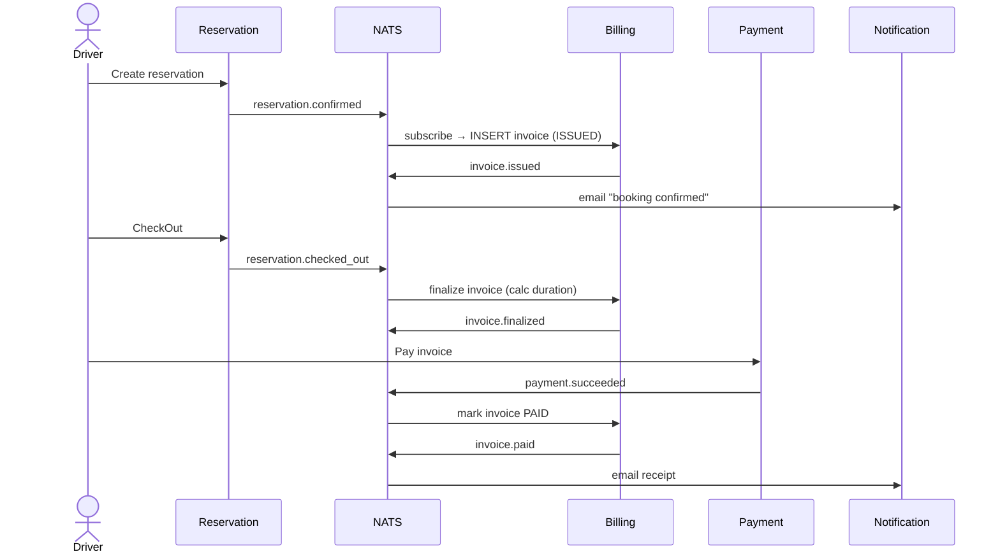
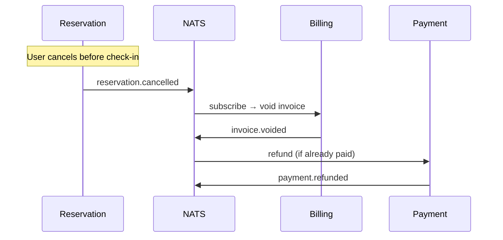

# ADR-0021: Distributed Transactions via Choreography Saga

| Status | Date | Decider | Supersedes |
|---|---|---|---|
| Accepted | 2026-05-20 | Aji P. | — |

## Context

ParkirPintar reservation flow melibatkan **state transition lintas service**:

```
Reservation → Billing → Payment → Notification
   (create)    (issue)   (charge)   (email)
```

Setiap step bisa **gagal independen**: Billing service crash setelah Reservation
sukses, Payment gateway timeout, Email service unavailable. Pertanyaan
arsitektur: **bagaimana ensure data consistency tanpa distributed transaction
2PC (yang notoriously fragile + expensive di microservices)?**

Use case explicit: "Availability: define how you handle retries, timeouts,
circuit breakers, and graceful degradation when non-core services fail."

Pattern industri untuk distributed transaction di microservices: **Saga Pattern**
(Hector Garcia-Molina & Kenneth Salem, 1987 — "Sagas" paper).

## Decision

**Adopt Choreography Saga** untuk reservation lifecycle, dengan:

1. **Event-driven choreography**: Setiap service publish event ke NATS, peers
   subscribe + react. Tidak ada central orchestrator.
2. **Compensation events**: Setiap forward action punya inverse compensation
   (cancel → void invoice, refund payment).
3. **Idempotent handlers**: Setiap subscriber idempotent via event ID dedup
   (ADR-0007).
4. **Per-step durability**: NATS JetStream durable consumer (at-least-once),
   plus outbox pattern di database (ADR-0006).

## Rationale

### Choreography vs Orchestration — Why Choreography

**Choreography Saga** (peer-to-peer, event-driven):
```
Reservation ──confirmed──▶ NATS ──▶ Billing
                                       │
                                       ▼ issued
                              NATS ──▶ Notification
```

**Orchestration Saga** (central coordinator, e.g., Temporal/Camunda):
```
            ┌─▶ Reservation
Orchestrator┼─▶ Billing
            └─▶ Payment
                   (synchronous calls + state machine)
```

| Aspect | Choreography (chosen) | Orchestration |
|---|---|---|
| Coupling | Loose (peers don't know each other) | Tight (orchestrator knows all) |
| Deployment | Simple — no extra orchestrator service | Need Temporal/Camunda cluster |
| Operational complexity | Lower (just NATS) | Higher (orchestrator HA, state store) |
| Observability | Distributed trace via OTel | Easier (state visible in orchestrator) |
| Saga visibility | Harder to see whole flow | Easier (orchestrator = single source) |
| Failure recovery | Per-service responsibility | Orchestrator handles retry/timeout |
| Cyclic dependency risk | Higher (event loops possible) | Lower (linear flow) |
| Best for | Simple linear flows (< 5 steps) | Complex flows (> 5 steps, branches) |

**ParkirPintar fits Choreography**:
- Reservation flow is **mostly linear** (5 steps)
- NATS already in stack (no new infrastructure)
- Service team boundary aligns with event ownership
- Operational simplicity prioritas untuk current scale
- Use case eksplisit pilih event-driven architecture

**Alternatif yang ditolak**:
- **Temporal/Camunda**: Adds operational burden untuk single small flow
- **2PC distributed transaction**: Notorious untuk lock contention + cascading
  failures. Anti-pattern di microservices.
- **Local transaction-only**: Tidak handle cross-service consistency

### Forward Flow — Happy Path



### Compensation Flow — Cancel/Refund



### Subject naming convention

Format: `<aggregate>.<event_type>.v<version>`

| Subject | Producer | Consumers | Action |
|---|---|---|---|
| `reservation.confirmed.v1` | reservation | billing | Issue invoice (booking fee) |
| `reservation.checked_in.v1` | reservation | notification | Email "you're parked" |
| `reservation.checked_out.v1` | reservation | billing | Finalize invoice (duration-based) |
| `reservation.cancelled.v1` | reservation | billing, payment, notification | Void + refund + notify |
| `reservation.expired.v1` | reservation (worker) | billing, notification | Charge booking fee only |
| `invoice.issued.v1` | billing | notification | Email invoice details |
| `invoice.finalized.v1` | billing | notification | Email final amount |
| `invoice.paid.v1` | billing | notification | Email receipt |
| `invoice.overdue.v1` | billing (worker) | reservation (blocking) | Mark driver as overdue |
| `payment.succeeded.v1` | payment | billing | Mark invoice PAID |
| `payment.failed.v1` | payment | notification | Email "payment failed, retry" |
| `payment.refunded.v1` | payment | notification | Email "refund processed" |

## Implementation Details

### 1. Event publishing — outbox pattern

Setiap producer write event ke **outbox table** dalam transaction yang sama
dengan business state update:

```sql
BEGIN;
UPDATE reservations SET status = 'CONFIRMED' WHERE id = $1;
INSERT INTO outbox (subject, payload, occurred_at) 
  VALUES ('reservation.confirmed.v1', $2, NOW());
COMMIT;
```

Background worker poll outbox → publish ke NATS → mark sent. Ensures
**atomicity**: kalau DB commit gagal, event tidak published.

### 2. Event consumption — durable JetStream consumer

```go
// Subscriber side
sub.Subscribe(ctx, "reservation.confirmed.v1", "billing-res-confirmed",
    func(ctx context.Context, env eventbus.Envelope) error {
        // Idempotency: check event_log dedup
        seen, _ := eventLog.Seen(ctx, env.ID)
        if seen { return nil }  // already processed
        
        // Business logic
        if err := svc.IssueInvoice(ctx, env); err != nil {
            return err  // nack → NATS redeliver
        }
        
        // Mark processed
        return eventLog.Append(ctx, env)
    })
```

Properties:
- **Durable consumer**: NATS remembers position across restart
- **At-least-once delivery**: Network failure → redeliver
- **Idempotency via event_log**: Dedupe by event ID
- **Manual ack**: Only ack after business logic + dedup write commit

### 3. Compensation — same pattern, inverse direction

Cancel event triggers:
```go
sub.Subscribe(ctx, "reservation.cancelled.v1", "billing-res-cancelled",
    func(ctx context.Context, env eventbus.Envelope) error {
        // Idempotent void (same invoice voided 2x = no-op)
        return svc.VoidInvoice(ctx, env.ReservationID)
    })
```

### 4. Saga state — emergent, not stored

Karena choreography, **no explicit saga state machine** stored. Saga state is
**implicit di semua participant DBs**:

| Service | Owns state for | Visible via |
|---|---|---|
| Reservation | State (CONFIRMED/CHECKED_IN/CHECKED_OUT/CANCELLED/EXPIRED) | `reservation.reservation.state` column |
| Billing | Invoice (DRAFT/ISSUED/PAID/VOID/OVERDUE) | `billing.invoice.status` column |
| Payment | Payment (PENDING/SUCCESS/FAILED/EXPIRED) | `payment.payment.status` column |
| Notification | Dispatch log (PENDING/SENT/FAILED) | `notification.notification_log.status` column |

Untuk **cross-service saga view**, gunakan OpenTelemetry distributed trace:
trace_id propagated melalui NATS metadata → single trace span semua services
yang touch one reservation.

### 5. Failure handling matrix

| Failure | Handler | Recovery |
|---|---|---|
| Service crash mid-flow | NATS durable consumer | Auto-resume on restart, event tetap di stream |
| Database deadlock | Local transaction retry | At-most 3 retry, then nack → NATS redeliver |
| External API timeout (Midtrans) | Circuit breaker (`pkg/cb`) | Fallback to async (mark PENDING, wait webhook) |
| Permanent business rule violation | Move to DLQ | Notification service own DLQ subject |
| Event schema breaking change | Buf breaking check | Reject at PR via CI |
| NATS server down | Application degraded | Reservation tetap accept (queue local), publish saat NATS recover |

## Consequences

### Positive

- ✅ **No 2PC overhead** — better availability + scalability
- ✅ **Operational simplicity** — no extra orchestrator service to maintain
- ✅ **Service autonomy** — each service team owns its own saga participation
- ✅ **Replayable** — event sourcing (ADR-0006) enables historical replay
- ✅ **Observable** — OTel propagation gives end-to-end trace view
- ✅ **Aligned with NATS stack** — no new infrastructure needed
- ✅ **Industry-proven pattern** — Uber, Lyft, Netflix all use choreography saga

### Negative

- ❌ **Saga visibility harder** — no central view of "all reservations in
  progress". Mitigation: OTel trace search di Tempo + dedicated dashboard
- ❌ **Cyclic dependency risk** — service A publish → service B publish →
  service A. Mitigation: code review + event flow diagram di ADR ini
- ❌ **Eventual consistency** — momentary state mismatch antara services
  (e.g., reservation CONFIRMED tapi invoice belum ISSUED). Mitigation:
  acceptable per use case (SLA < 1 second normal, < 10 second worst case)
- ❌ **Compensation logic burden** — setiap forward action butuh compensation.
  Mitigation: explicit di code + tested via E2E cancel scenarios
- ❌ **Choreography hard to scale > 7 services** — Mitigation: kalau scope
  expand beyond 7 services, consider hybrid (orchestration for complex flows,
  choreography for simple)

### Risks

| Risk | Likelihood | Mitigation |
|---|---|---|
| Event ordering matters but JetStream doesn't guarantee strict | Medium | Use timestamp-based ordering di consumer; no operations that depend on exact order |
| Compensation logic incomplete | Medium | E2E test untuk every cancel path |
| Poison message stuck in stream | Low | DLQ subject + manual intervention runbook |
| Schema drift across services | Low | Proto schema as source of truth + buf breaking check |

## Validation

### Functional tests

- **E2E happy path** (`test/e2e/happy-path.spec.ts`): Reservation → Billing →
  Payment → Notification full flow
- **E2E cancellation** (`test/e2e/cancel.spec.ts`): Reservation cancel → invoice
  voided → refund triggered → email sent
- **E2E expiry** (`test/e2e/expiry.spec.ts`): Reservation no-show → expired event
  → 5000 IDR booking fee invoice → email
- **Integration test idempotency**: Same event published 2x → handler executed
  exactly once (event_log dedup)

### Chaos tests

- **NATS down mid-flow**: Reservation created, NATS stops, Billing should
  recover when NATS back up (event re-delivered)
- **Billing crash mid-event**: Event partially processed, restart should
  complete idempotently via event_log

### Observability validation

- **Distributed trace**: Single reservation = single trace di Tempo dengan
  spans across all 4 services
- **Service map**: Tempo Service Map menampilkan event flow

## References

- Garcia-Molina, H. & Salem, K. (1987). "Sagas". ACM SIGMOD.
- [microservices.io: Saga pattern](https://microservices.io/patterns/data/saga.html)
- [Chris Richardson — Saga Pattern](https://chrisrichardson.net/post/microservices/2019/07/09/developing-sagas-part-3.html)
- Newman, Sam (2021). *Building Microservices*, 2nd ed. — Chapter 6 (Saga)
- [Uber Engineering — Cadence/Temporal motivation](https://www.uber.com/blog/cadence-microservice-architecture/)

## Related ADRs

- [ADR-0005](0005-nats-jetstream.md) — NATS JetStream choice
- [ADR-0006](0006-event-sourcing-billing.md) — Event sourcing di Billing
- [ADR-0007](0007-idempotency.md) — Idempotency key per step
- [ADR-0011](0011-anti-overlap-strategy.md) — Anti double-booking (per-service invariants)
- [ADR-0014](0014-hybrid-payment-overdue-blocking.md) — Graceful degradation kalau Billing down
- [docs/architecture/diagrams/sequences.md](../diagrams/sequences.md) — Full sequence diagrams
- [pkg/eventbus/](../../../pkg/eventbus/) — NATS publisher/subscriber implementation
