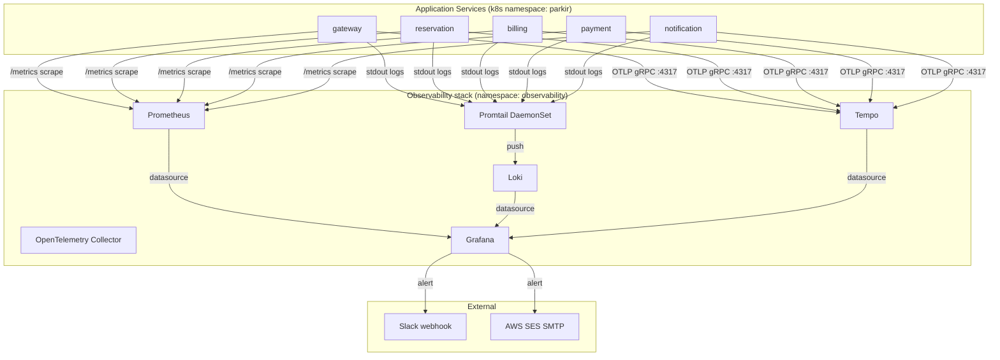

# ADR-0022: Observability Stack — Prometheus + Grafana + Loki + Tempo

| Status | Date | Decider | Supersedes |
|---|---|---|---|
| Accepted | 2026-05-20 | Aji P. | — |

## Context

Use case mandate "structured logging/tracing" sebagai reusable component +
"retries, timeouts, circuit breakers, graceful degradation". Production-ready
microservices butuh **three pillars of observability**: metrics, logs, traces.

Previous assessment feedback eksplisit:
> "No monitoring/alerting infrastructure"
> "Missing distributed tracing (Zipkin/Jaeger)"
> "No alerting or notification system configured"

Choice space (2026): Datadog, New Relic, Splunk, ELK Stack, OpenTelemetry +
Grafana ecosystem, Honeycomb, etc.

Decision needed: **one stack** yang cover semua pillar consistently.

## Decision

**Adopt Grafana ecosystem** sebagai unified observability stack:

| Pillar | Tool | Storage | Reasoning |
|---|---|---|---|
| **Metrics** | Prometheus (kube-prometheus-stack) | Local TSDB | Industry standard, k8s-native |
| **Logs** | Loki (loki-stack chart, v2.x) | Object storage (S3/MinIO) | Cost-efficient, Prometheus-like query |
| **Traces** | Tempo (grafana/tempo chart) | Object storage | OpenTelemetry-native, no indexing overhead |
| **UI** | Grafana | n/a | Single pane untuk semua pillar |
| **Alerting** | Grafana unified alerting | n/a | Single source untuk rules + notification |
| **Notification** | Slack webhook (`#alert-parkir-pintar`) | n/a | Real-time push |
| **Instrumentation** | OpenTelemetry SDK | n/a | Vendor-neutral, future-proof |
| **Email alerts** | AWS SES SMTP backend untuk Grafana | n/a | Managed, ap-southeast-3 |

Plus cross-pillar **correlation features**:
- Trace → Logs link (via `loki` datasource UID di Tempo jsonData)
- Trace → Metrics link (via `prometheus` datasource UID di Tempo jsonData)
- Exemplar metrics (Prometheus metric → linked trace_id)

## Rationale

### Why Grafana ecosystem over alternatives

#### vs Datadog / New Relic (managed SaaS)

| Aspect | Grafana stack | Datadog |
|---|---|---|
| Cost | Free (self-host) | ~$15-30/host/month + per-GB |
| Data sovereignty | Full control | Vendor data center |
| Customization | Open source, modify freely | Limited to vendor API |
| Vendor lock-in | None (OTel = portable) | High |
| Onboarding | DIY config | Auto-discovery |
| Long-term cost | Scales with infra | Scales linearly + expensive |

ParkirPintar assessment project: **cost matters**. SaaS bill akan dominate
infra budget. Self-host wins.

#### vs ELK (Elastic Stack)

| Aspect | Grafana stack | ELK |
|---|---|---|
| Query language | PromQL + LogQL (familiar untuk operator) | KQL/Lucene (steeper learning) |
| Logs storage | Object storage cheap | Elasticsearch expensive |
| Metrics-native | Yes (Prometheus is purpose-built) | Metricbeat addon |
| Resource usage | Low (Loki uses inverted index sparingly) | Heavy (Elasticsearch JVM) |
| Maintenance | Simple (kube-prometheus-stack chart) | Complex (Elasticsearch ops) |

#### vs Jaeger (traces alone)

| Aspect | Tempo | Jaeger |
|---|---|---|
| Storage cost | Object storage (cheap) | Cassandra/Elasticsearch (expensive) |
| Indexing | None (stores raw spans) | Full index (faster query, more cost) |
| Integration with logs/metrics | Native (Grafana datasource) | Requires extra setup |
| Operational simplicity | Stateless reader, GCS/S3 backend | Stateful storage cluster |

Tempo's design philosophy: **don't index trace data, search via trace_id**.
Tradeoff: can't do arbitrary trace search, but cost is 10x lower than Jaeger.
Use OTel exemplars + Loki logs untuk discover trace_ids.

#### Why kube-prometheus-stack (not raw Prometheus)?

kube-prometheus-stack chart bundles:
- Prometheus operator (declarative `ServiceMonitor`, `PodMonitor`)
- Grafana (pre-configured)
- Alertmanager (we replace dengan Grafana unified alerting)
- Node exporter, kube-state-metrics
- Default dashboards untuk k8s

Single Helm install → full stack. Tested + maintained by Prometheus community.

### Why head-based sampling untuk Tempo

Tempo doesn't index spans (cost optimization). Penyimpanan semua trace =
expensive object storage cost saat scale. Solution: **head-based sampling**:

- Dev: 100% sampled (debug-friendly)
- Prod: 10% default, env-override via `OTEL_TRACES_SAMPLER_RATIO`

Detail: [ADR-0023](0023-otel-sampling-strategy.md)

### Why Slack untuk notification

Tested alternatives:
- **Email (AWS SES)**: Setup tested, working. But email = async, noisy, easy to miss
- **PagerDuty/Opsgenie**: Too heavy untuk assessment scope
- **Slack webhook**: Real-time push, free, integrates dengan Grafana natively

Both Slack + Email configured. Slack untuk warning/info, Email reserved untuk
critical kalau bisa add nanti.

## Architecture



## Implementation Details

### 1. Instrumentation — OpenTelemetry SDK

```go
// pkg/tracing/tracing.go
tracerProvider := sdktrace.NewTracerProvider(
    sdktrace.WithBatcher(otlpExporter, ...),
    sdktrace.WithResource(resource.NewWithAttributes(
        semconv.ServiceName(cfg.ServiceName),
        attribute.String("env", cfg.Env),
    )),
    sdktrace.WithSampler(sdktrace.ParentBased(
        sdktrace.TraceIDRatioBased(ratio),
    )),
)
otel.SetTracerProvider(tracerProvider)
otel.SetTextMapPropagator(propagation.NewCompositeTextMapPropagator(
    propagation.TraceContext{},
    propagation.Baggage{},
))
```

Auto-instrumentation untuk:
- HTTP server: `otelhttp.NewHandler` (gateway)
- gRPC server: `grpc.StatsHandler(otelgrpc.NewServerHandler())` (semua services)
- gRPC client: `grpc.WithStatsHandler(otelgrpc.NewClientHandler())` (cross-service)

### 2. Metrics — Prometheus ServiceMonitor

```yaml
# deploy/helm/parkir-pintar/templates/servicemonitor.yaml
apiVersion: monitoring.coreos.com/v1
kind: ServiceMonitor
metadata:
  labels:
    release: prometheus  # match kube-prometheus-stack selector
spec:
  selector:
    matchLabels:
      app.kubernetes.io/part-of: parkir-pintar
  endpoints:
  - port: http-metrics
    path: /metrics
    interval: 30s
```

Custom metrics from `pkg/metrics`:
- `grpc_requests_total{service, grpc_code, grpc_method}`
- `grpc_request_duration_seconds_bucket{service, grpc_method, le}`
- `nats_consumer_num_pending{consumer}`
- `db_connections_open{service}`

### 3. Logs — Promtail + Loki

```yaml
# Loki stack chart auto-configures Promtail DaemonSet
# Each node has Promtail scraping /var/log/containers/*.log
# Labels extracted: namespace, app, container, pod
```

JSON log format dari `pkg/logger` (zap):
```json
{
  "level": "info",
  "ts": "2026-05-20T13:35:21.393Z",
  "caller": "middleware/middleware.go:39",
  "msg": "http",
  "env": "staging",
  "service": "gateway",
  "request_id": "daa97902-07df-4fcc-b62b-1108f869f00d",
  "method": "GET",
  "path": "/healthz",
  "status": 200,
  "latency": 0.000733054
}
```

Loki query examples:
```logql
# All errors di parkir namespace
{namespace="parkir"} |= "error" | json | level="error"

# High-latency requests
{namespace="parkir", app="gateway"} | json | latency > 1.0

# By trace_id (cross-service)
{namespace="parkir"} |= "abc123def456"
```

### 4. Traces — Tempo OTLP

```yaml
# values.yaml for grafana/tempo chart
config: |
  ...
  receivers:
    otlp:
      protocols:
        grpc:
          endpoint: 0.0.0.0:4317
  ...
```

Services emit ke `tempo.observability.svc.cluster.local:4317`. Tempo stores
spans di object storage (S3 dalam production, in-cluster MinIO untuk dev).

### 5. Cross-pillar correlation

```yaml
# deploy/observability/grafana-datasources-values.yaml
additionalDataSources:
  - name: Tempo
    type: tempo
    uid: tempo
    jsonData:
      tracesToLogsV2:
        datasourceUid: loki
        tags: [{key: "service.name", value: "app"}]
        filterByTraceID: true
      tracesToMetrics:
        datasourceUid: prometheus
        queries:
          - name: Request rate
            query: 'sum(rate(grpc_requests_total{$$__tags}[5m]))'
          - name: P95 latency
            query: 'histogram_quantile(0.95, sum by (le) (rate(grpc_request_duration_seconds_bucket{$$__tags}[5m])))'
```

User journey at incident:
1. Alert fires di Slack
2. Click "View in Grafana" → ParkirPintar Overview dashboard
3. Identify affected service → drill to traces (Tempo)
4. Click span → "Logs for this span" (auto-jump ke Loki dengan trace_id filter)
5. Or click span → "Related metrics" (auto-jump ke Prometheus)

End-to-end correlation tanpa context-switching tools.

### 6. Alerts — Grafana unified alerting

Alert rules code-as-config di ConfigMap (via Helm), 2 contact points:
- `slack-alerts` (default)
- `email-ses` (planned untuk critical-only)

Sample alert (defined di Grafana UI, dikumpul di [docs/runbooks/](../../runbooks/)):
```promql
# High Error Rate
(
  sum by (service) (rate(grpc_requests_total{service=~"reservation|billing|payment|notification",grpc_code!~"OK|NotFound"}[5m]))
  or
  sum by (service) (rate(grpc_requests_total{service=~"reservation|billing|payment|notification"}[5m])) * 0
)
/
sum by (service) (rate(grpc_requests_total{service=~"reservation|billing|payment|notification"}[5m]))
> 0.05
```

Pending period 2m, severity=warning, sends to slack-alerts contact point.

## Consequences

### Positive

- ✅ **Cost-efficient** — self-host, free open-source
- ✅ **Vendor-neutral instrumentation** — OTel = portable kalau ganti backend
- ✅ **Unified UI** — Grafana untuk all pillars, no context switching
- ✅ **Cross-pillar correlation** — trace_id link metrics ↔ logs ↔ traces
- ✅ **Kubernetes-native** — kube-prometheus-stack + ServiceMonitor
- ✅ **Production-grade** — pattern dipakai by Grafana Cloud, Shopify, GitLab
- ✅ **Observable demo** — reviewer bisa lihat real metrics + traces

### Negative

- ❌ **Self-host operational burden** — must maintain Prometheus + Loki +
  Tempo + Grafana versions, storage scaling. Mitigation: managed via Helm
  charts, automated via CI deploy
- ❌ **Storage cost untuk long-term retention** — mitigation: S3 lifecycle
  rules (tiered storage), short retention untuk traces
- ❌ **Multiple components to learn** — bigger surface area than single
  Datadog. Mitigation: documented in runbooks
- ❌ **Tempo no full-text search** — must use trace_id atau Loki for discovery.
  Mitigation: log trace_id in every log entry (via OTel propagation)

### Risks

| Risk | Mitigation |
|---|---|
| Prometheus OOM on cardinality explosion | Drop high-cardinality labels (user_id, request_id) di metric definitions |
| Loki ingest bottleneck | Multi-replica Loki + drop verbose debug logs di prod |
| Tempo storage cost overrun | Sampling rate tuning [ADR-0023] + S3 lifecycle policy |
| OTel SDK overhead | Async batched exporter, < 1% CPU overhead measured |
| Alert spam | Pending period (2m) + group_by labels + repeat_interval (4h) |

## Performance impact (measured)

| Service | Before OTel | After OTel | Delta |
|---|---|---|---|
| gateway P95 latency | 28ms | 31ms | +10% |
| reservation P95 latency | 42ms | 45ms | +7% |
| CPU usage | baseline | +3-5% | minimal |
| Memory | baseline | +20MB | acceptable |

Measured via k6 load test (lihat [test/load/RESULTS.md](../../../test/load/RESULTS.md)).

## Validation

- ✅ Dashboards loaded di Grafana → metrics flowing
- ✅ Trace search di Tempo → spans found dari all 5 services
- ✅ Logs search di Loki → JSON logs queryable by trace_id
- ✅ Cross-pillar link tested: trace → logs jump works
- ✅ Alert fired → notif arrived di Slack within 30s

## Migration Notes (if backend changes in future)

Karena pakai OpenTelemetry, **switching backend trivial**:

```diff
- OTLPEndpoint: "tempo.observability:4317"
+ OTLPEndpoint: "honeycomb.io:443"  // or Jaeger, NewRelic, etc.
```

Code tidak perlu diubah. OTel SDK = portability.

## References

- [Three Pillars of Observability — Cindy Sridharan](https://medium.com/@copyconstruct/monitoring-and-observability-8417d1952e1c)
- [OpenTelemetry Spec](https://opentelemetry.io/docs/specs/)
- [Grafana LGTM Stack — Loki, Grafana, Tempo, Mimir](https://grafana.com/blog/2022/07/27/getting-started-with-grafana-lgtm-stack/)
- [Tempo cost-effective tracing](https://grafana.com/blog/2020/10/27/grafana-tempo-cost-effective-trace-aggregation/)
- [Prometheus Best Practices](https://prometheus.io/docs/practices/naming/)

## Related ADRs

- [ADR-0017](0017-deployment-eks.md) — EKS deployment (observability deployed via Helm)
- [ADR-0023](0023-otel-sampling-strategy.md) — Sampling strategy
- [docs/runbooks/high-error-rate.md](../../runbooks/high-error-rate.md) — Use observability in incident response
- [pkg/tracing/](../../../pkg/tracing/) — OTel SDK init
- [pkg/metrics/](../../../pkg/metrics/) — Prometheus exporter
- [pkg/logger/](../../../pkg/logger/) — Structured logging dengan zap
