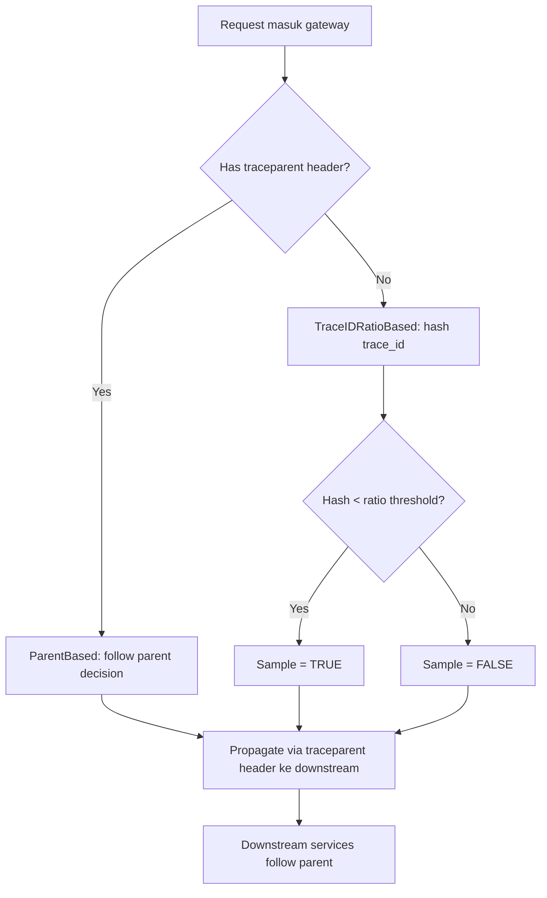

# ADR-0023: OpenTelemetry Sampling Strategy — Head-Based with Env Override

| Status | Date | Decider | Supersedes |
|---|---|---|---|
| Accepted | 2026-05-20 | Aji P. | — |

## Context

OpenTelemetry traces capture full request flow lintas services. Setiap trace
berisi multiple spans (1 per service hop). Untuk system dengan moderate
traffic (~500 req/s), full sampling = **massive storage cost**:

```
500 req/s × 4 services × ~5KB per span × 86400 s/day = ~870 GB/day raw spans
```

Tempo storage cost (S3): ~$20/TB/month → ~$520/month untuk dev environment.
Production scale akan worse.

Use case mention "graceful degradation" + ParkirPintar punya cost optimization
mindset ([ADR-0017](0017-deployment-eks.md) — aws-sleep scripts).

Pertanyaan: **berapa persen trace harus di-sample, dan oleh siapa?**

## Decision

**Adopt head-based sampling** dengan **per-environment ratio** + **runtime
env-var override**:

| Environment | Default Ratio | Override env var |
|---|---|---|
| `dev` | 100% (1.0) | `OTEL_TRACES_SAMPLER_RATIO` |
| `staging` | 50% (0.5) | `OTEL_TRACES_SAMPLER_RATIO` |
| `prod` | 10% (0.1) | `OTEL_TRACES_SAMPLER_RATIO` |
| Demo/load test | 100% (1.0) — temporary | `OTEL_TRACES_SAMPLER_RATIO=1.0` |

**Sampler type**: `ParentBased(TraceIDRatioBased)`. Sampler decision di-make
di **entry point** (gateway), dipropagate ke semua downstream services via
W3C `traceparent` header. Downstream services follow parent's decision.

## Rationale

### Why head-based, not tail-based

| Aspect | Head-based (chosen) | Tail-based |
|---|---|---|
| Decision point | Trace start (gateway) | After trace complete |
| Storage cost | Predictable (ratio × throughput) | Need full ingestion first |
| Backend complexity | Simple (any OTel backend) | Needs OTel Collector with state |
| Bias | Random sampling | Can prioritize errors/slow traces |
| Operational complexity | Low | High (collector aggregation buffer) |

**ParkirPintar context**: Tempo doesn't support tail-based sampling out-of-the-box
(needs Grafana Cloud Trace Sampler atau OTel Collector dengan state). Cost +
complexity ga justify untuk current scale.

### Why ParentBased + TraceIDRatioBased combination

```go
sdktrace.WithSampler(
    sdktrace.ParentBased(
        sdktrace.TraceIDRatioBased(ratio),
    ),
)
```

**ParentBased semantics**:
- Kalau request datang dengan `traceparent` header (existing trace) → ikut
  parent's sampling decision (sampled or not). Ensures **trace integrity**:
  full trace ada di Tempo, bukan partial.
- Kalau request datang tanpa `traceparent` (new trace, e.g., from gateway) →
  apply TraceIDRatioBased.

**TraceIDRatioBased semantics**:
- Hash trace_id → consistent decision per trace
- Same trace_id always sampled atau not (deterministic)
- Ratio 0.1 = 10% of all unique trace_ids sampled

Combined effect:
- Gateway (entry point) generates trace_id → applies 10% sampling
- Reservation service receives trace via gRPC + `traceparent` → ikut decision
- Billing service receives via NATS event (with trace context) → ikut decision
- Trace is **fully sampled or fully dropped** across all services

### Why env-var override

Saat debugging production issue, sometimes butuh **temporary boost** sampling
ke 100% untuk capture full flow. Tanpa env var override, perlu code change +
deploy.

Pattern dari ADR ini:
```go
ratio := cfg.SamplerRatio
if ratio <= 0 { ratio = 0.1 }
if cfg.Env == "dev" { ratio = 1.0 }

// Runtime override — change tanpa rebuild
if v := getEnv("OTEL_TRACES_SAMPLER_RATIO"); v != "" {
    if r, err := strconv.ParseFloat(v, 64); err == nil && r >= 0 && r <= 1 {
        ratio = r
    }
}
```

Operasional procedure:
1. Identify pod yang debugged
2. `kubectl set env deploy/<service> OTEL_TRACES_SAMPLER_RATIO=1.0 -n parkir`
3. Pod restart → 100% sampling aktif
4. Debug selesai → revert: `kubectl set env deploy/<service> OTEL_TRACES_SAMPLER_RATIO=0.1 -n parkir`

### Why not always 100% in prod

Per Grafana Tempo docs: untuk ParkirPintar scale (~100 RPS expected prod):

| Sampling | Spans/day | Storage/day (5KB/span × 4 services) | $/month (S3) |
|---|---|---|---|
| 100% | 34.6M | 692 GB | ~$14 |
| 50% | 17.3M | 346 GB | ~$7 |
| 10% | 3.46M | 69 GB | ~$1.4 |
| 1% | 346K | 7 GB | ~$0.14 |

100% feasible untuk dev (free MinIO storage), tapi production: 10% give
statistically significant sample dengan reasonable cost. Storage cost akan
escalate kalau traffic naik 10x → 10% sampling memberi headroom.

### Why dev = 100%

Dev environment punya low traffic + high need untuk debugging. Cost negligible
(minutes of total spans). 100% = guaranteed visibility untuk all flows.

## Implementation Detail

### Sampling decision flow



### Code reference

File: `pkg/tracing/tracing.go`

```go
func Init(ctx context.Context, cfg Config) (func(context.Context) error, error) {
    // ... exporter + resource setup ...

    ratio := resolveSamplerRatio(cfg, os.Getenv)

    tp := sdktrace.NewTracerProvider(
        sdktrace.WithBatcher(exp, ...),
        sdktrace.WithResource(res),
        sdktrace.WithSampler(sdktrace.ParentBased(
            sdktrace.TraceIDRatioBased(ratio),
        )),
    )

    otel.SetTracerProvider(tp)
    otel.SetTextMapPropagator(propagation.NewCompositeTextMapPropagator(
        propagation.TraceContext{},  // W3C traceparent
        propagation.Baggage{},
    ))
    return tp.Shutdown, nil
}

// Extracted untuk testability — lihat ADR-0020 dan pkg/tracing/internal_test.go
func resolveSamplerRatio(cfg Config, getEnv func(string) string) float64 {
    ratio := cfg.SamplerRatio
    if ratio <= 0 { ratio = 0.1 }  // default prod
    if cfg.Env == "dev" { ratio = 1.0 }
    
    if v := getEnv("OTEL_TRACES_SAMPLER_RATIO"); v != "" {
        if r, err := strconv.ParseFloat(v, 64); err == nil && r >= 0 && r <= 1 {
            ratio = r
        }
    }
    return ratio
}
```

Comprehensively unit-tested di `pkg/tracing/internal_test.go` (8 test cases
covering all branches: default, dev override, env override valid, env override
invalid, boundary values).

### W3C trace context propagation

OpenTelemetry propagators serialize trace context to:

**HTTP requests** (`traceparent` header):
```
traceparent: 00-4bf92f3577b34da6a3ce929d0e0e4736-00f067aa0ba902b7-01
             │  └─ trace_id (32 hex) ────────┘ └─ span_id ──┘ └ flags
             └ version
```

**gRPC requests** (metadata):
```
:authority: gateway:8080
traceparent: 00-4bf92f3577b34da6a3ce929d0e0e4736-00f067aa0ba902b7-01
tracestate: vendor=foo
```

**NATS messages** (header):
```
X-Parkir-Trace-Context: 00-4bf92f3577b34da6a3ce929d0e0e4736-...
```
(Implemented di `pkg/eventbus/nats.go` via `propagation.TextMapPropagator`)

Hasil: **single trace_id** seamless lintas HTTP → gRPC → NATS → gRPC → HTTP.

## Trade-offs

### Positive

- ✅ **Predictable storage cost** — linear dengan ratio × throughput
- ✅ **Trace integrity** — full trace, never partial spans
- ✅ **Runtime tunability** — env var override tanpa rebuild
- ✅ **Statistical validity** — 10% random sampling masih representative untuk
  P95/P99 calculation kalau N besar
- ✅ **Standard OTel pattern** — portable kalau ganti backend
- ✅ **Per-env configurable** — dev high, prod efficient

### Negative

- ❌ **Miss rare events** — bug yang hanya muncul 1 dari 1000 requests, dengan
  10% sampling = 100x lebih sulit di-capture. Mitigation: env override boost
  saat investigating known issue
- ❌ **No prioritization** — head-based ga bisa "always sample errors". Mitigation:
  metric-based alert (Prometheus) catch error spike, env override boost saat
  triage
- ❌ **Sampling decision public** — `traceparent` header expose sample bit ke
  client. Acceptable (no security issue)
- ❌ **Bias risk kalau ratio terlalu kecil** — < 1% might miss critical patterns.
  Mitigation: minimum 10% di prod, kalau perlu kurang gunakan dedicated tail-based
  collector

## Future Improvements

### Tail-based sampling (kalau scale 10x+)

Setelah traffic > 1000 RPS, head-based 10% mungkin masih kemahalan. Option:

1. **OTel Collector dengan tail-based sampler**:
   ```yaml
   processors:
     tail_sampling:
       policies:
         - name: error-traces
           type: status_code
           status_code: { status_codes: [ERROR] }
         - name: slow-traces
           type: latency
           latency: { threshold_ms: 1000 }
         - name: probabilistic
           type: probabilistic
           probabilistic: { sampling_percentage: 5 }
   ```
   
   Effect: 100% errors + 100% slow + 5% random = ~10% volume tapi smarter.

2. **Grafana Cloud Trace Sampler**: managed tail-based, integrates langsung
   dengan Tempo

### Hybrid sampling (dev tools)

Untuk feature flag testing, allow user-specific 100% sampling:

```go
// Pseudo-code
if userID := ctx.Value("user_id"); isInDebugList(userID) {
    return sdktrace.AlwaysSample()
}
return defaultSampler
```

Useful untuk "shadow user" debugging in production.

## Validation

### Unit tests

`pkg/tracing/internal_test.go` covers:
- Default prod ratio (0.1)
- Dev env override (1.0)
- Negative SamplerRatio fallback ke default
- Env var override (valid: 0, 0.5, 1.0)
- Env var override (invalid: non-numeric, out-of-range)
- Boundary values [0, 1] inclusive
- Empty env value ignored

### Integration validation

Run k6 load test (`make test-load`) dengan dev env (100% sampling):
- Verify Tempo received traces ~= total request count
- Verify Trace Service Map shows all 4 services connected
- Verify zero "broken trace" (missing span middle)

Then with prod env (10% sampling):
- Verify ~10% of traces in Tempo
- Verify random distribution (not skewed)

## References

- [OpenTelemetry Specification — Sampling](https://opentelemetry.io/docs/specs/otel/trace/sdk/#sampling)
- [W3C Trace Context Spec](https://www.w3.org/TR/trace-context/)
- [Grafana Tempo Sampling Best Practices](https://grafana.com/docs/tempo/latest/operations/best-practices/)
- [Honeycomb — Why Tail-Based Sampling Matters](https://www.honeycomb.io/blog/dynamic-sampling-by-example) (motivasi untuk future improvement)

## Related ADRs

- [ADR-0022](0022-observability-stack.md) — Tempo backend choice
- [ADR-0005](0005-nats-jetstream.md) — NATS untuk event propagation (trace context propagated via header)
- [pkg/tracing/](../../../pkg/tracing/) — implementation
- [pkg/tracing/internal_test.go](../../../pkg/tracing/internal_test.go) — comprehensive unit tests
