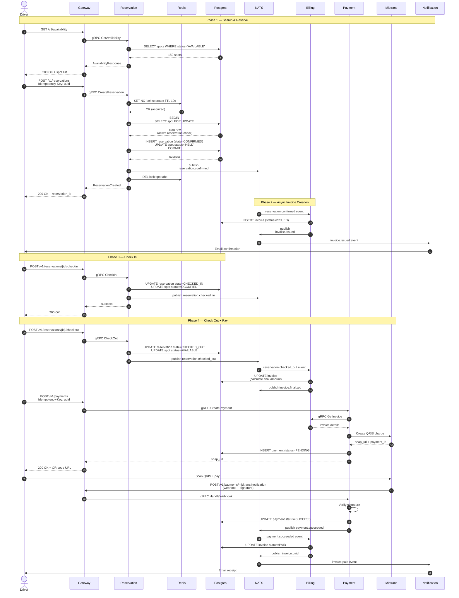
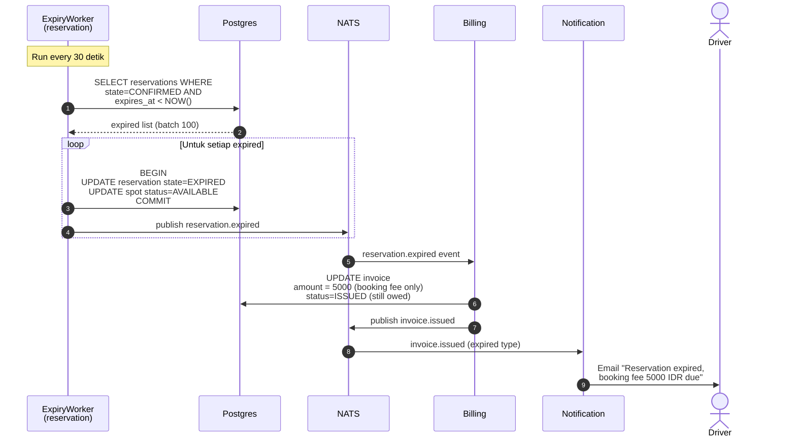
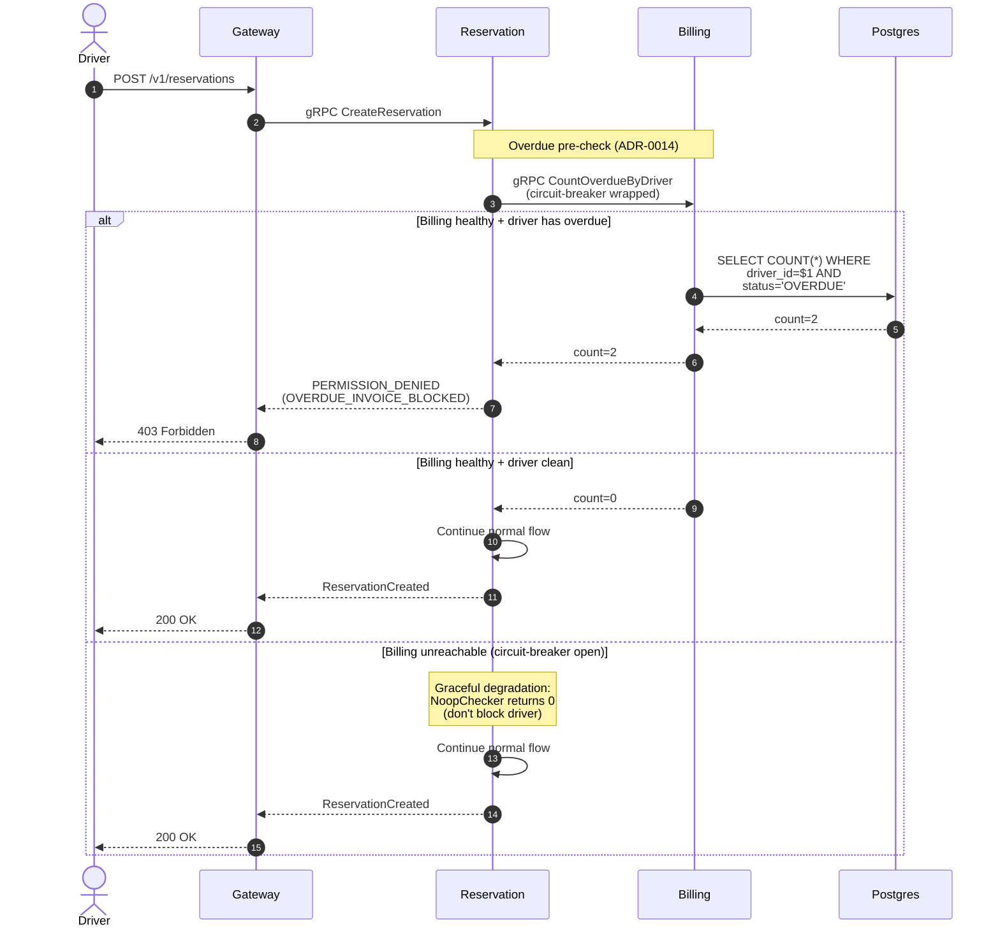
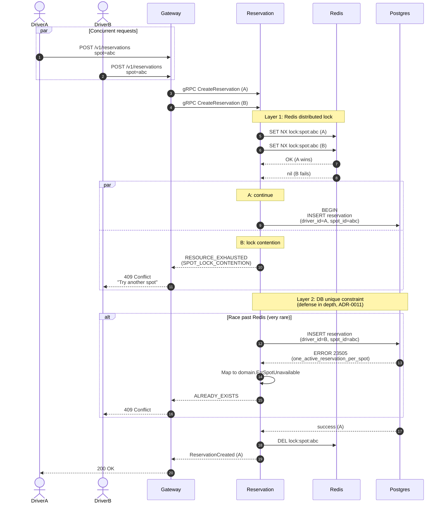
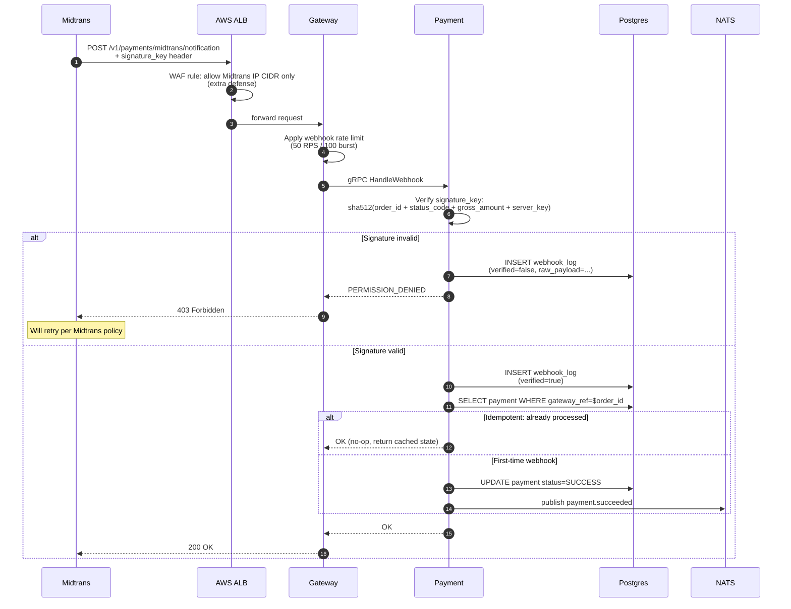
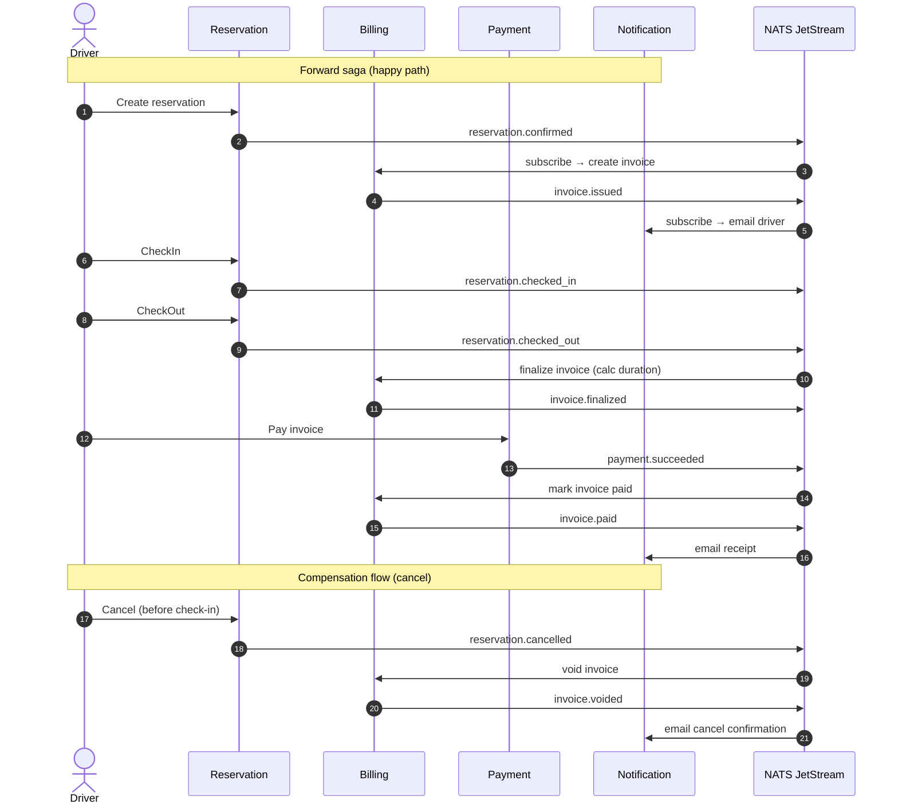

# Sequence Diagrams — Critical Business Flows

Sequence diagrams untuk complex multi-service flows di ParkirPintar.
Format: Mermaid. View di GitHub atau VSCode Markdown Preview Enhanced.

## 1. Reservation Lifecycle — Happy Path

End-to-end happy path dari driver open app → check-out + invoice paid.

## 2. Reservation Expiry — No-show Flow

Driver tidak check-in dalam 1 jam → auto-expire + fee.

## 3. Overdue Invoice — Driver Blocking (ADR-0014)

Driver dengan unpaid invoice > 24h tidak bisa create new reservation.

## 4. Concurrent Same-Spot Reservation — Anti Double-Booking

2 drivers race untuk same spot. Hexagonal locks ensure exclusive.

## 5. Payment Webhook — Signature Verification

Midtrans webhook callback dengan defense-in-depth.

## 6. Event-Driven Reservation Saga (Choreography)

Cross-service workflow via NATS events, no central orchestrator.

## Notes on diagram maintenance

- **Update saat business logic berubah** — diagrams sebagai contract
- **Source of truth** = code, diagram is reflection
- **Lint check**: Mermaid syntax via GitHub markdown preview
- **CI integration**: belum (future improvement — auto-render PNG ke wiki)

## Related

- [ADR-0001](../adr/0001-microservices-vs-monolith.md) — service decomposition
- [ADR-0006](../adr/0006-event-driven-nats.md) — NATS choice
- [ADR-0011](../adr/0011-postgres-unique-constraints.md) — anti double-booking
- [ADR-0014](../adr/0014-overdue-invoice-circuit-breaker.md) — graceful degradation
- [docs/api/idempotency.md](../../api/idempotency.md) — header behavior
