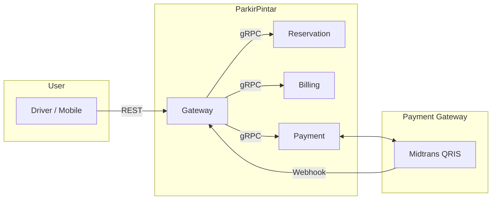
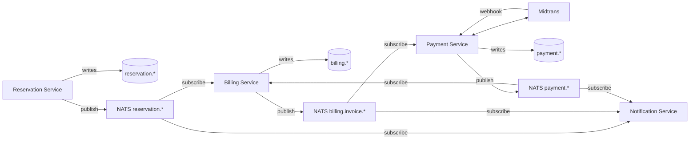

# System Overview Diagrams

> Mermaid diagrams yang juga ada inline di README.md, di-pisah sini untuk maintenance.

## C4 Context

## Sequence: Booking → Billing → Payment

(Lihat README.md §2.3)

## Sequence: No-show Auto-Expiry

(Lihat README.md §2.4)

## Data Flow

