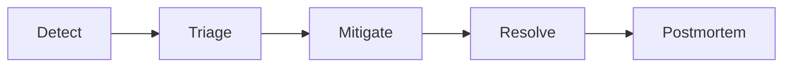

# Runbook — Incident Response

> Operasional response ketika produksi terganggu. Memenuhi kompetensi #2.5 (Handling error/bug Level 4).

## Severity Levels

| Sev | Definisi | Response Time | On-call action |
|---|---|---|---|
| SEV-1 | Service down, > 50% user impact | 5 menit | Page on-call + senior eng + EM |
| SEV-2 | Degraded, ≤ 50% impact | 15 menit | Page on-call |
| SEV-3 | Single feature broken, workaround ada | 1 jam | Issue tracker, fix di sprint |
| SEV-4 | Cosmetic, low impact | next sprint | Backlog |

## Incident Workflow



### 1. Detect

- Alerts: Prometheus → Alertmanager → PagerDuty/Slack
- Common alerts:
  - `reservation_5xx_rate > 5%` for 2m
  - `db_pool_exhausted`
  - `nats_consumer_lag > 100`
  - `payment_webhook_signature_failed_rate > 1%`

### 2. Triage

Acknowledge alert. Buka war-room channel `#incident-<sev>-<short-id>`.

Cek dashboard:
- **Grafana → ParkirPintar Overview**: error rate, latency P95, throughput per service
- **Jaeger**: trace 5xx untuk root cause
- **Loki**: `{service="reservation"} |= "ERROR"`

### 3. Mitigate

#### Pattern 1: Reservation 5xx spike

```bash
# Cek error log
kubectl logs -n parkir -l app.kubernetes.io/name=reservation --tail=500 | grep ERROR

# Cek DB connection
kubectl exec -it deploy/reservation -- /reservation --health
psql $DB_URL -c "SELECT * FROM pg_stat_activity WHERE state='active';"

# Mitigasi cepat:
# - Scale up replica: kubectl scale deploy reservation --replicas=6
# - Restart unhealthy pod: kubectl rollout restart deploy/reservation
# - Rollback last release: helm rollback parkir-pintar
```

#### Pattern 2: Payment webhook failed

```bash
# Cek webhook_log table
psql $DB_URL -c "SELECT count(*), verified FROM payment.webhook_log
                 WHERE received_at > now() - interval '15 minutes'
                 GROUP BY verified;"

# Kalau signature mismatch:
# 1. Cek MIDTRANS_SERVER_KEY di Secrets Manager (rotated?)
# 2. Cek Midtrans dashboard config notification URL
# 3. Replay webhook manual:
#    curl -X POST $GW/v1/payments/midtrans/notification -d @<payload>
```

#### Pattern 3: NATS consumer lag

```bash
# Cek consumer
nats-cli consumer info PARKIRPINTAR billing-res-confirmed

# Reset consumer kalau stuck
nats-cli consumer rm PARKIRPINTAR billing-res-confirmed
# (akan re-create otomatis saat billing service restart)

# Kalau backlog parah, scale billing replica
kubectl scale deploy billing --replicas=4
```

#### Pattern 4: Double-book detected (worst case)

```bash
# 1. Identify the duplicate
psql $DB_URL -c "
  SELECT spot_id, COUNT(*) FROM reservation
  WHERE state IN ('CONFIRMED','CHECKED_IN')
  GROUP BY spot_id HAVING COUNT(*) > 1;
"

# 2. Refund yang lebih baru, manual notify driver
# 3. Open SEV-1 — ini bug yang melewati EXCLUDE constraint!
# 4. Snapshot DB, dump app log, simpan untuk RCA
```

### 4. Resolve

- Verifikasi metric kembali normal selama ≥ 15 menit
- Update status page
- Close war-room

### 5. Postmortem (within 5 working days)

Pakai template di [`../postmortem-template.md`](../postmortem-template.md).

Distribusi: engineering team + EM + SRE. Action items wajib ada owner + due date.

## Communication Template

### Initial alert (Slack)

```
🚨 SEV-X — <short title>
Detected: HH:MM UTC
Impact: <user-visible effect>
Suspect: <component>
War-room: #incident-...
Lead: @oncall
Updates every: 15 min
```

### Resolution

```
✅ Resolved — <title>
Duration: H:MM
Root cause: <one-liner>
Fix: <one-liner>
Postmortem: by <date>
```

## Useful Commands Cheatsheet

```bash
# Top 10 slowest queries
psql -c "SELECT query, mean_exec_time, calls FROM pg_stat_statements ORDER BY mean_exec_time DESC LIMIT 10;"

# Active locks
psql -c "SELECT * FROM pg_locks WHERE NOT granted;"

# NATS stream status
nats-cli stream info PARKIRPINTAR

# Trace distribution
curl http://jaeger:16686/api/traces?service=reservation&limit=10

# Load test target endpoint cepat
k6 run -d 30s -u 50 test/load/reservation.js
```
