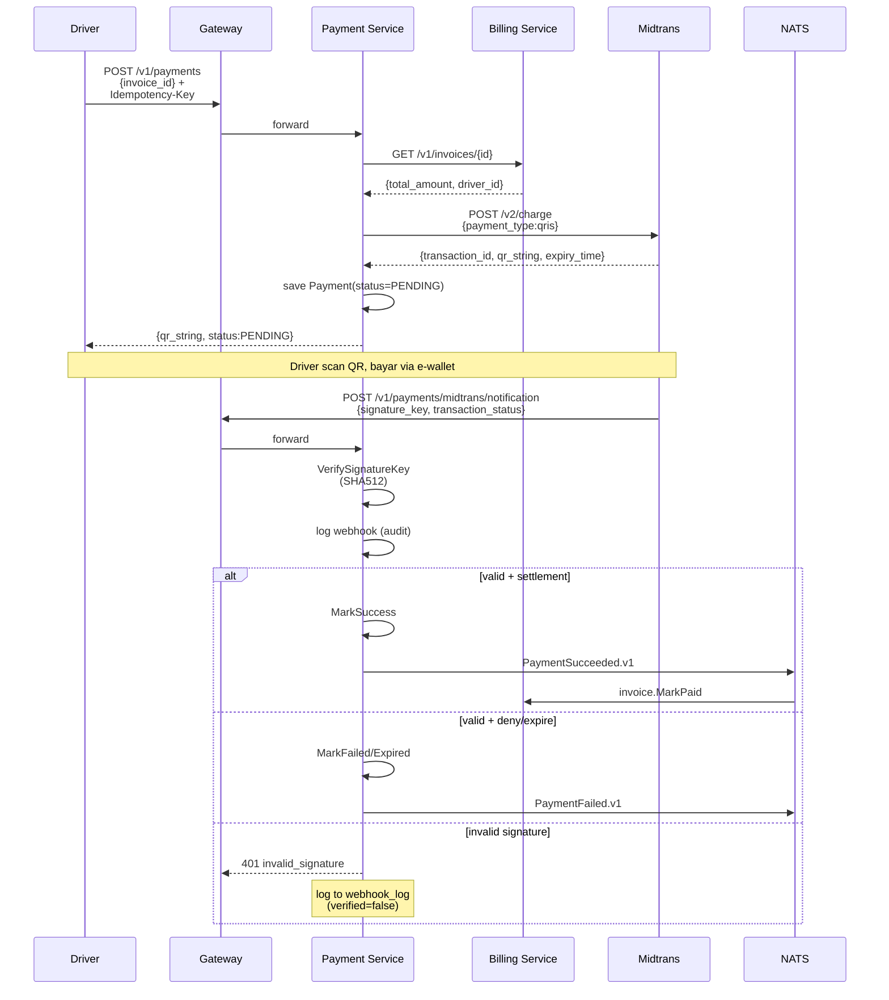

# Runbook — Midtrans QRIS Integration

> Operasional payment service terhadap Midtrans Sandbox/Production. Memenuhi kompetensi #2.4 (Integrate and implement API) + #5 (security webhook).

## Mode Operasional

Payment service punya 2 mode (env `PAYMENT_MOCK_MODE`):

| Mode | Kapan dipakai | Behavior |
|---|---|---|
| `true` (default) | Demo offline, smoke test, CI | Mock client return fake QR string, no real call ke Midtrans |
| `false` | Real sandbox testing, staging, prod | Real HTTPS POST ke `api.sandbox.midtrans.com/v2/charge` |

## Setup Sandbox

```
1. Daftar gratis: https://dashboard.sandbox.midtrans.com
2. Settings → Access Keys
   - Server Key (SB-Mid-server-XXX)  → ke env MIDTRANS_SERVER_KEY
   - Client Key (SB-Mid-client-XXX)  → frontend, optional di backend
3. Settings → Configuration → Payment Notification URL:
   https://<public-host>/v1/payments/midtrans/notification
   - Dev local: pakai ngrok / cloudflared tunnel
   - K8s: pakai Ingress public + cert-manager
4. Set env:
   PAYMENT_MOCK_MODE=false
   MIDTRANS_SERVER_KEY=SB-Mid-server-XXX
```

## Flow Lengkap



## Idempotency Layers

3 lapis defense terhadap duplicate operations:

| Layer | Trigger | Mechanism |
|---|---|---|
| 1. Client retry | User klik 2x, network glitch | Header `Idempotency-Key` → `pkg/idempotency.Wrap` |
| 2. Same invoice repeat | Frontend re-call CreatePayment | Check existing PENDING payment by invoice_id, return same QR |
| 3. Webhook redelivery | Midtrans retry kalau timeout | Domain `MarkSuccess`/`MarkFailed` return nil kalau sudah di state target. NATS publish dengan MsgID = envelope.id (JetStream dedup) |

## Webhook Signature Verification

Algoritma resmi Midtrans (lihat `pkg/midtrans.VerifySignatureKey`):

```
expected_sig = sha512(order_id + status_code + gross_amount + server_key)
verify       = constantTimeEqual(expected_sig, payload.signature_key)
```

**Implementation notes**:
- Pakai `constantTimeEqual` (XOR-based) untuk **anti-timing-attack**.
- Webhook dengan signature SALAH **tetap di-log** ke `webhook_log` (kolom `verified=false`) — untuk security investigation.
- Response 401 `invalid_signature` → Midtrans **akan retry** sampai 5x (sesuai retry policy mereka). Pastikan signature yang valid pasti diterima.

## Status Mapping

| Midtrans `transaction_status` | + `fraud_status` | → Internal `Payment.Status` | NATS Event |
|---|---|---|---|
| `capture`, `settlement` | `accept` (atau empty) | `SUCCESS` | `payment.succeeded.v1` |
| `capture`, `settlement` | `challenge` | (no change, manual review) | — |
| `capture`, `settlement` | `deny` | `FAILED` | `payment.failed.v1` |
| `deny` | — | `FAILED` | `payment.failed.v1` |
| `cancel` | — | `FAILED` | `payment.failed.v1` |
| `failure` | — | `FAILED` | `payment.failed.v1` |
| `expire` | — | `EXPIRED` | `payment.failed.v1` |
| `pending` | — | (no change) | — |
| unknown | — | (no change, log only) | — |

## Demo Walkthrough (Tanpa Internet)

```bash
# 1. Boot stack
make demo-up && make demo-wait && make seed

# 2. Run full demo (akan create payment, dapat QR mock)
./scripts/demo.sh
# Output: PAYMENT_ID=<uuid>

# 3. Simulasi Midtrans webhook settlement (success)
./scripts/simulate-midtrans-webhook.sh <PAYMENT_ID> settlement
# Verifikasi: payment status = SUCCESS

# 4. Coba simulasi webhook dengan signature SALAH
MIDTRANS_SERVER_KEY=WRONG ./scripts/simulate-midtrans-webhook.sh <PAYMENT_ID> settlement
# Expect: HTTP 401, payment status TIDAK berubah, webhook_log bertambah dgn verified=false

# 5. Cek audit trail webhook
docker compose -f deploy/docker/docker-compose.yml exec postgres \
  psql -U parkir parkirpintar -c \
  "SELECT received_at, source, verified FROM payment.webhook_log ORDER BY received_at DESC LIMIT 5;"

# 6. Skenario lain
./scripts/simulate-midtrans-webhook.sh <PAYMENT_ID> expire
./scripts/simulate-midtrans-webhook.sh <PAYMENT_ID> deny
./scripts/simulate-midtrans-webhook.sh <PAYMENT_ID> capture  # FRAUD_STATUS=challenge bisa di-export
```

## Real Sandbox Walkthrough

```bash
# 1. Set credentials
export MIDTRANS_SERVER_KEY=SB-Mid-server-XXX
export PAYMENT_MOCK_MODE=false

# 2. Start tunnel ke localhost (Midtrans butuh public URL untuk webhook)
ngrok http 8080
# Copy https://xxxx.ngrok.io

# 3. Set di Midtrans dashboard:
#    Settings → Configuration → Payment Notification URL =
#    https://xxxx.ngrok.io/v1/payments/midtrans/notification

# 4. Restart payment service
docker compose -f deploy/docker/docker-compose.yml up -d payment

# 5. Buat reservation + checkout + invoice (sama seperti demo.sh)
# 6. Buat payment → akan dapat QR string ASLI
# 7. Scan QR pakai Gopay sandbox / SimulatePayment di dashboard Midtrans
# 8. Midtrans akan POST webhook ke ngrok URL → payment service process → invoice PAID
```

## Troubleshooting

### "midtrans charge: http 401"
Server Key salah / kosong. Cek env `MIDTRANS_SERVER_KEY`.

### "midtrans charge: http 406"
Currency/format error. Pastikan amount integer, `gross_amount` tanpa decimal di sandbox.

### Webhook tidak masuk
- Cek Notification URL di Midtrans dashboard match dengan public URL
- Cek tunnel (ngrok/cloudflared) masih aktif
- Cek firewall/security group allow inbound 443 dari IP Midtrans
- Cek `webhook_log` table — kalau ada entry dengan `verified=false`, signature problem (server key salah)

### Replay attack concern
Midtrans signature ter-bind ke `order_id + status_code + gross_amount + server_key`. Tidak ada nonce/timestamp. Mitigasi:
- `gateway_ref` UNIQUE di DB → duplicate `transaction_id` dari Midtrans di-reject oleh DB constraint.
- Domain `MarkSuccess` idempotent → safe untuk replay yang sah.
- Untuk extra hardening: simpan `signature_key` di `webhook_log` dan reject duplicate dalam window 24 jam.

## Production Hardening Checklist

- [ ] Rotate `MIDTRANS_SERVER_KEY` di AWS Secrets Manager (manual via dashboard Midtrans, no auto-rotate)
- [ ] IP allowlist di ALB/Ingress untuk webhook endpoint (Midtrans publish IP range di dashboard)
- [ ] Rate limit webhook endpoint terpisah (lebih ketat dari endpoint user)
- [ ] Alert kalau `payment_webhook_signature_failed_rate > 1%` (kemungkinan attack atau key rotated)
- [ ] Alert kalau `payment_pending_unresolved > 30min` (gateway lambat / webhook hilang)
- [ ] Daily reconciliation job: bandingkan payment table dengan Midtrans dashboard report
- [ ] PCI DSS SAQ A self-assessment (no card data stored)
